# PhantomRelay Architecture

## Overview

PhantomRelay is a runtime-oriented networking platform built around a central orchestration runtime responsible for lifecycle management, subsystem supervision, routing state, resource ownership, and runtime-wide coordination.

Rather than treating proxy rotation, DNS resolution, or traffic interception as standalone features, PhantomRelay models networking infrastructure as a collection of runtime-managed services operating under a common control plane.

The architecture is built around a small set of principles:

* Runtime owns orchestration.
* Services own behavior.
* Kernel owns connections.
* Subsystems are authoritative.
* Capabilities are injected explicitly.
* Recovery is preferred over coupling.

---

# High-Level Architecture

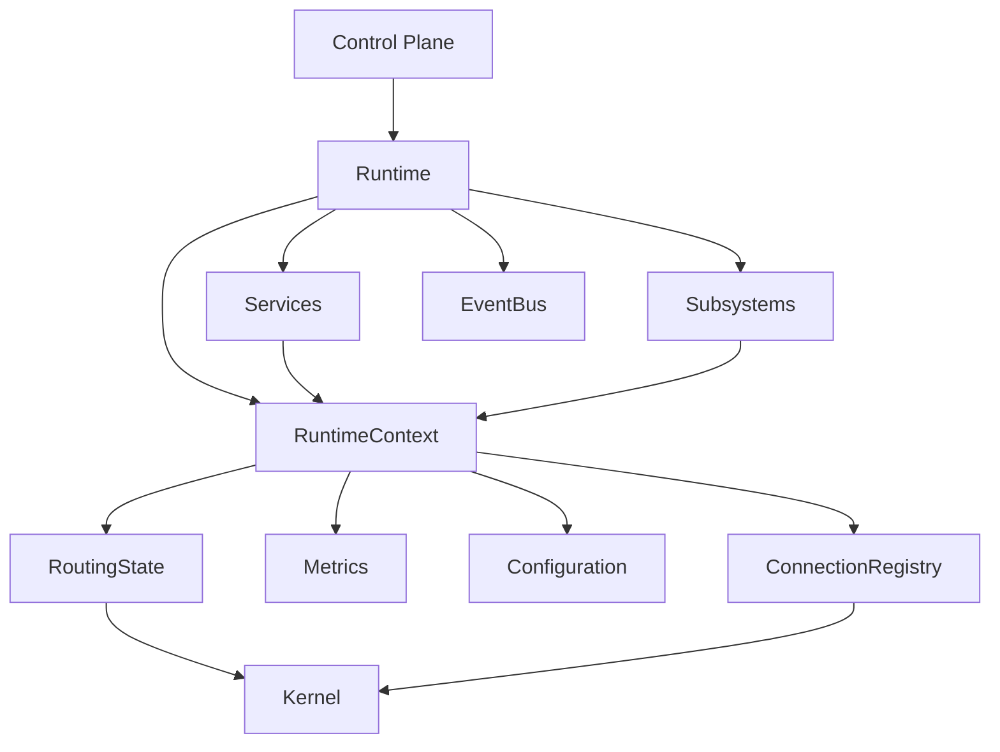

The runtime forms the center of the system.

Everything else exists under runtime authority.

---

# Ownership Model

The ownership model defines architectural authority.

Every major system component has a clearly defined owner.

## Runtime Owns

* Service lifecycle
* Service registration
* Service supervision
* Subsystem supervision
* Runtime context
* Routing state
* Shared resources
* Capability injection
* Startup ordering
* Shutdown ordering

The runtime is the authoritative owner of orchestration.

---

## Services Own

* Internal execution logic
* Internal tasks
* Internal scheduling
* Service-local state
* Service-specific resources

Services do not own global state.

Services do not supervise other services.

Services operate only on capabilities explicitly provided by the runtime.

---

## Subsystems Own

* Core networking primitives
* Route selection
* Network coordination
* System-wide infrastructure state

Subsystems represent authoritative infrastructure layers.

Unlike services, subsystems are considered critical runtime components.

---

## Kernel Owns

* TCP state machines
* Socket lifetime
* Active connections
* Connection transport state

PhantomRelay does not reimplement the network stack.

Connections ultimately belong to the operating system.

---

## CLI Owns

* User interaction
* Runtime requests
* Runtime inspection

The CLI is a control plane only.

It does not participate in orchestration.

---

# Runtime Model

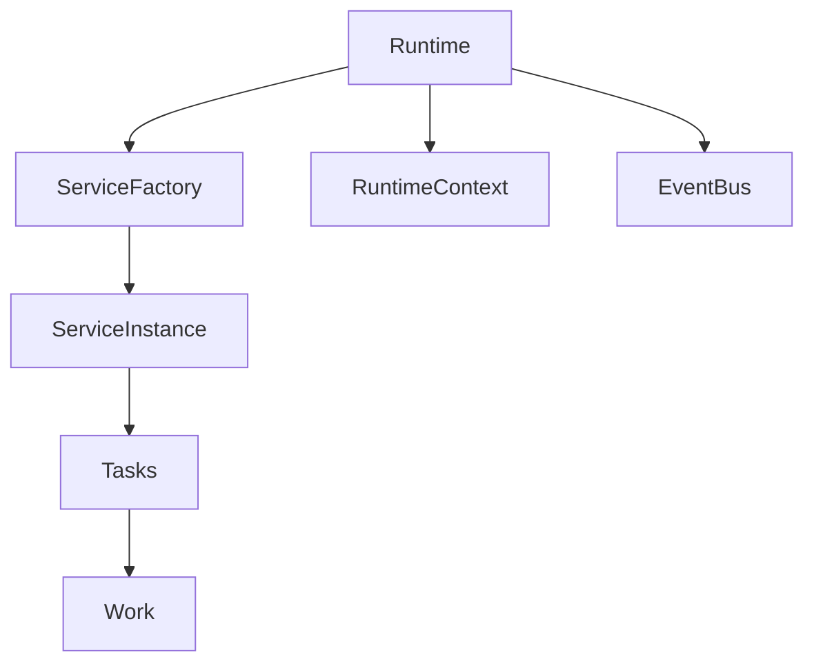

The runtime is responsible for creating, supervising, and destroying service instances.

Services manage their own execution.

Tasks remain internal service implementation details.

---

# Runtime Context

The RuntimeContext serves as the capability boundary of the system.

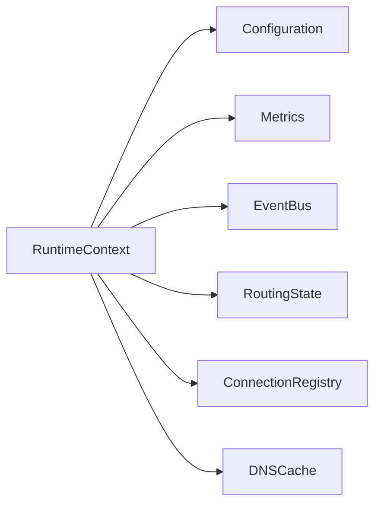

The runtime constructs the context.

Services receive only the capabilities they require.

Capability propagation stops at service boundaries.

A service cannot obtain arbitrary runtime state unless the runtime explicitly provides access.

This architecture prevents accidental coupling between services while preserving centralized resource ownership.

---

# Service Architecture

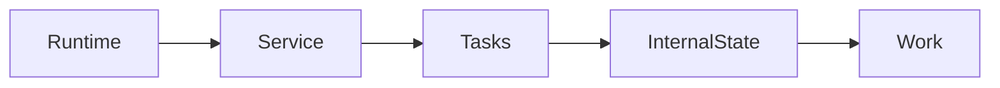

Services are intentionally isolated.

A service may be started, stopped, restarted, or removed without requiring changes to unrelated services.

Services communicate through explicit interfaces and shared runtime capabilities.

No service is permitted to directly supervise another service.

---

# Event Bus Architecture

PhantomRelay uses a unified runtime-owned event bus.

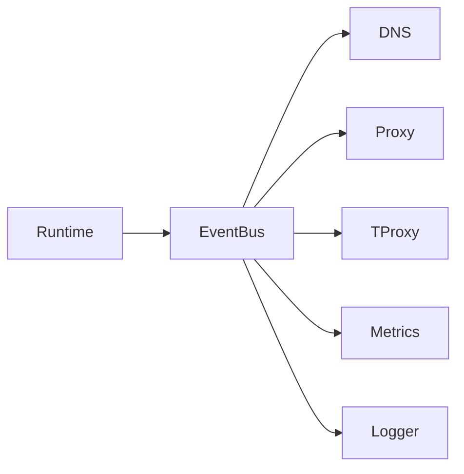

The event bus acts as the central communication backbone.

Characteristics:

* Runtime owned
* Broadcast based
* Strongly typed events
* Selective subscriptions
* Unified transport layer

Services subscribe only to events relevant to their responsibilities.

The runtime remains authoritative regardless of event flow.

The event bus is not a service orchestration mechanism.

Lifecycle operations remain runtime privileges.

---

# Service Lifecycle

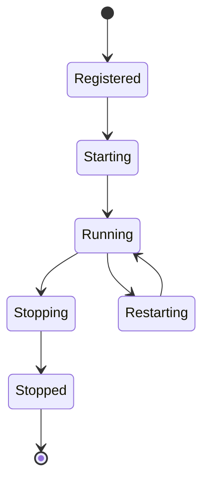

Services exist entirely under runtime supervision.

The runtime guarantees:

* Registration before execution
* Ordered startup
* Ordered shutdown
* Supervised restart behavior
* Consistent capability injection

---

# Subsystem Architecture

Subsystems differ from services.

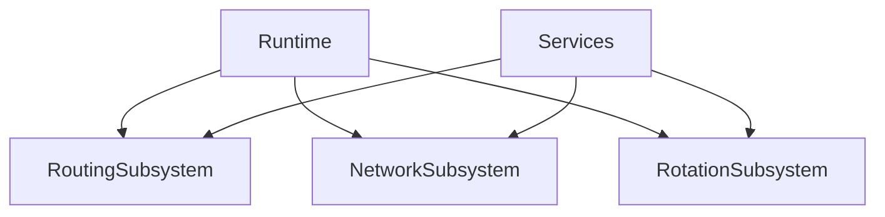

Subsystems represent foundational infrastructure required by multiple services.

If a subsystem becomes unavailable, runtime integrity may be compromised.

Subsystems are therefore treated differently from ordinary services.

---

# Routing Architecture

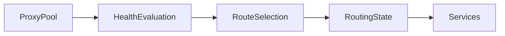

Routing decisions are generated from runtime-owned routing state.

Route selection may incorporate:

* Health information
* Latency information
* Geographic information
* Rotation policies

Services consume routing state.

Services do not own routing state.

---

# DNS Architecture

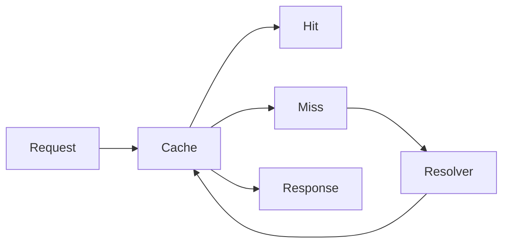

DNS resolution follows routing decisions.

The resolver operates against the same routing infrastructure used by traffic mediation.

This ensures DNS behavior remains consistent with runtime routing state.

---

# Connection Architecture

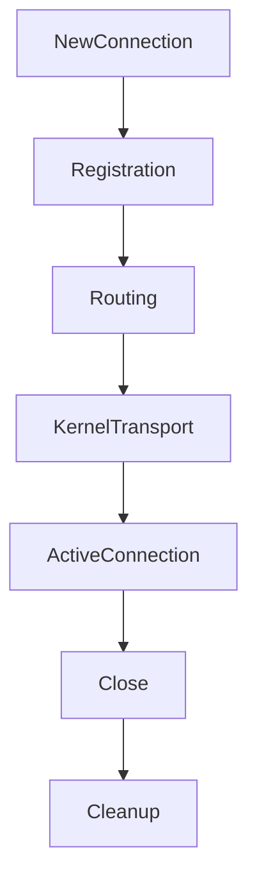

Connections are briefly observed during creation.

Once handed to the operating system, connection transport becomes kernel-owned.

PhantomRelay tracks connection existence and metadata but does not assume ownership of transport state.

---

# Transparent Traffic Flow

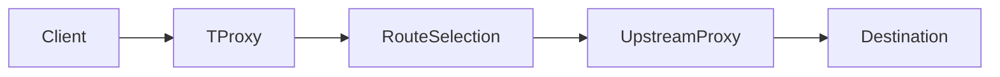

Transparent interception allows traffic mediation without application-level modification.

The original destination remains preserved throughout routing decisions.

---

# Control Plane Architecture

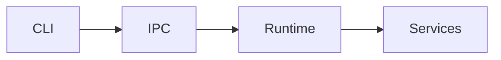

The control plane exists outside service execution.

Responsibilities include:

* Runtime inspection
* Service management
* Debug operations
* Status reporting
* Runtime configuration actions

The control plane does not directly manipulate service internals.

All operations are mediated through runtime authority.

---

# Architectural Invariants

The following invariants are expected to remain true across all releases.

### Runtime Invariants

* Runtime owns orchestration.
* Runtime owns supervision.
* Runtime owns shared resources.
* Runtime owns routing state.

### Service Invariants

* Services remain isolated.
* Services receive explicit capabilities only.
* Services do not supervise one another.
* Services own their internal behavior.

### Subsystem Invariants

* Subsystems are authoritative.
* Subsystems remain runtime managed.

### Connection Invariants

* Kernel owns active transport.
* PhantomRelay tracks but does not own transport state.

### Control Plane Invariants

* CLI remains external.
* Runtime remains authoritative.

---

# Design Philosophy

PhantomRelay prioritizes operational clarity through explicit ownership and authority boundaries.

The architecture intentionally favors:

* Predictable supervision
* Explicit capability injection
* Strong ownership boundaries
* Service isolation
* Runtime-managed coordination
* Kernel-native networking behavior

The goal is not to build a collection of networking utilities.

The goal is to provide a runtime capable of coordinating networking infrastructure through a consistent operational model.
