# Component Architecture

Detailed implementation overview of PhantomRelay's major runtime components, ownership boundaries, dependency relationships, and operational behavior.

This document focuses on component responsibilities and interactions.

For architectural philosophy, ownership principles, and system-wide design decisions, see `ARCHITECTURE.md`.

---

# Component Dependency Graph

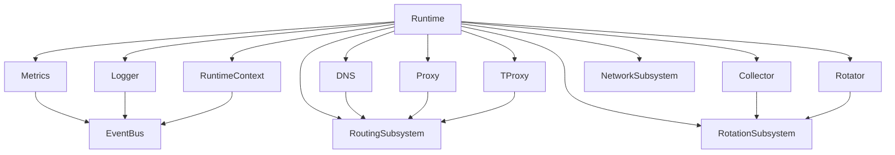

---

# Runtime Controller

The Runtime Controller is responsible for orchestrating service lifecycle and maintaining runtime-wide state.

## Responsibilities

* Service registration
* Service startup
* Service shutdown
* Service restart
* Runtime supervision
* Context construction
* Dependency validation
* IPC request routing

## Ownership

### Runtime Owns

* Service lifecycle
* Runtime context
* Shared resources
* Routing state
* Service registry

### Services Own

* Internal execution
* Internal tasks
* Local state

### CLI Owns

* User interaction only

---

# Runtime Context

The Runtime Context serves as the central capability container constructed during startup.

Services receive only the capabilities they require.

Capability propagation terminates at service boundaries.

## Provided Capabilities

* Configuration access
* Event bus access
* Routing information
* Metrics access
* DNS cache access
* Connection registry access
* Proxy health information

Services cannot access arbitrary runtime resources unless explicitly provided by the runtime.

---

# Service Model

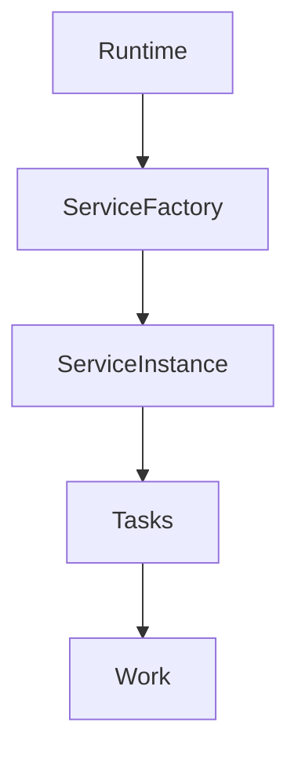

## Lifecycle

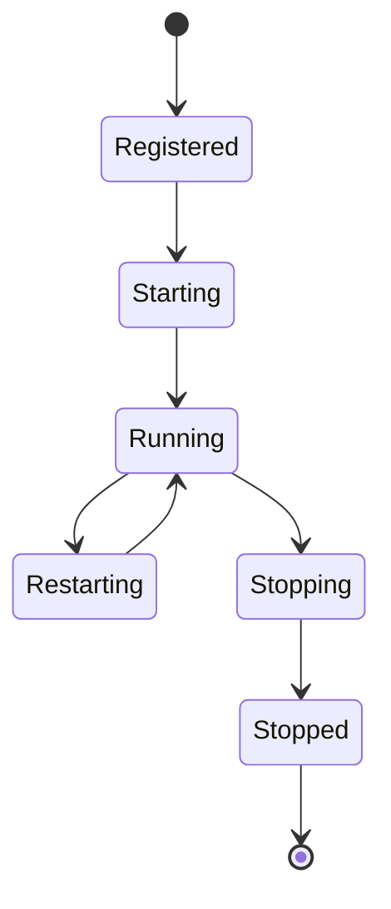

Services remain under runtime supervision for their entire lifecycle.

---

# Startup Flow

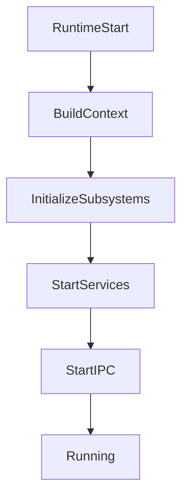

---

# Shutdown Flow

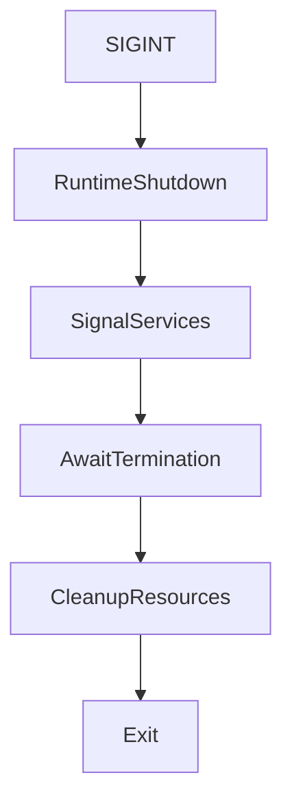

---

# DNS Component

## Responsibilities

* DNS query processing
* Cache management
* Resolver execution
* Cache prewarming
* Cache cleanup

## Ownership

### Runtime Owns

* DNS lifecycle
* DNS configuration

### DNS Service Owns

* Query processing
* Cache maintenance
* Resolver behavior

### Kernel Owns

* UDP transport
* Socket state

---

## DNS Pipeline

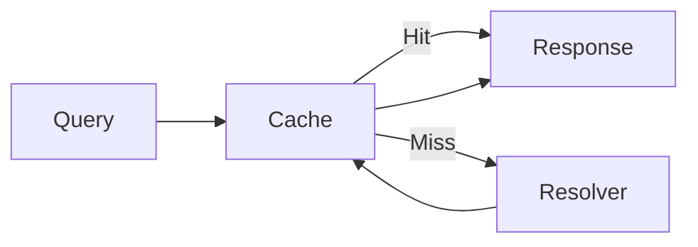

---

## Internal Components

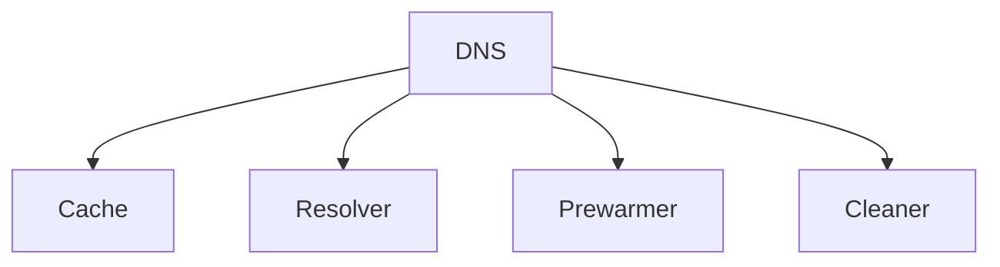

---

## Failure Domain

### DNS Failure

Impact:

* DNS resolution unavailable
* Existing proxy connections continue operating
* Existing active traffic unaffected

Recovery:

* Runtime restart
* Service restart

---

# Rotation Component

## Responsibilities

* Route selection
* Proxy rotation
* Health-aware routing
* Route advertisement

## Ownership

### Runtime Owns

* Routing lifecycle
* Routing state

### Rotation Service Owns

* Rotation execution
* Route updates

### Collector Owns

* Health evaluation

---

## Routing Flow

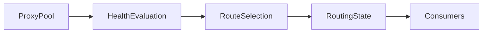

---

## Failure Domain

### Rotation Failure

Impact:

* Route updates stop
* Existing routes remain valid
* Existing connections unaffected

Recovery:

* Runtime restart
* Service restart

---

# Collector Component

## Responsibilities

* Proxy health validation
* Latency measurement
* Health state publication
* Route quality assessment

---

## Health Evaluation Flow

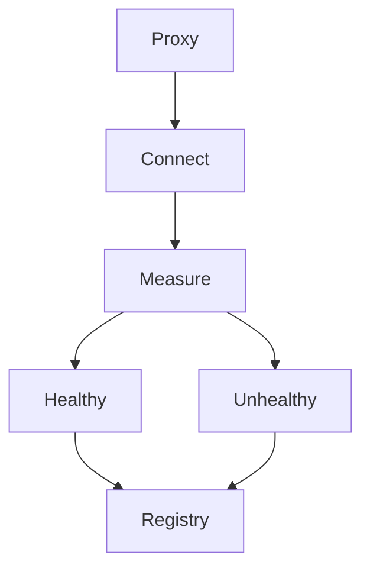

---

## Failure Domain

### Collector Failure

Impact:

* Health information becomes stale
* Existing routes continue functioning
* Existing traffic unaffected

Recovery:

* Runtime restart
* Service restart

---

# TProxy Component

## Responsibilities

* Transparent interception
* Original destination extraction
* Route assignment
* Traffic mediation

## Ownership

### Runtime Owns

* TProxy lifecycle
* Routing information

### TProxy Owns

* Interception handling
* Connection mediation

### Kernel Owns

* Connection transport
* TCP state
* Socket lifetime

---

## Traffic Flow

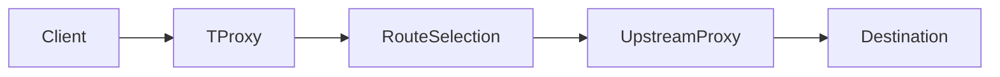

---

## Failure Domain

### TProxy Failure

Impact:

* Transparent interception unavailable
* Direct proxy mode unaffected

Recovery:

* Runtime restart
* Service restart

---

# Direct Proxy Component

## Responsibilities

* SOCKS5 listener
* Proxy negotiation
* Route assignment
* Connection relay

---

## Traffic Flow

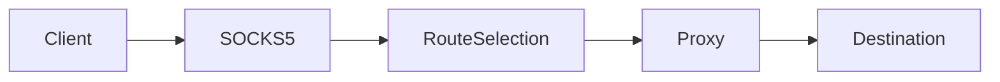

---

## Failure Domain

### Proxy Service Failure

Impact:

* New SOCKS5 sessions fail
* Existing active sessions continue
* Transparent mode unaffected

Recovery:

* Runtime restart
* Service restart

---

# Connection Registry

## Responsibilities

* Connection tracking
* State visibility
* Runtime diagnostics
* Metrics support

## Connection Lifecycle

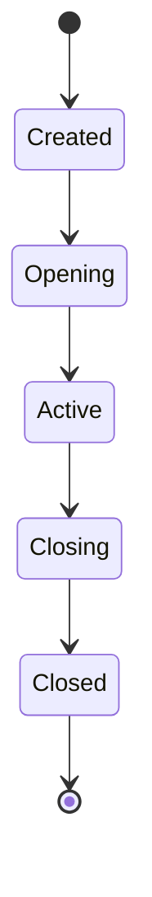

---

## Ownership

### Runtime Owns

* Registry lifecycle

### Connection Registry Owns

* Connection metadata

### Kernel Owns

* Active transport state

---

# Event Bus

The Event Bus is the central communication backbone of PhantomRelay.

## Characteristics

* Runtime owned
* Broadcast based
* Strongly typed events
* Selective subscriptions
* Shared transport layer

---

## Event Flow

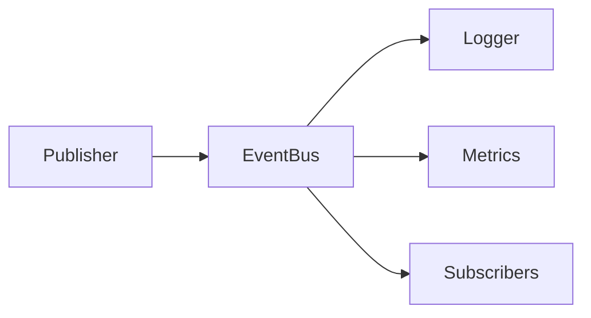

---

## Event Bus Non-Goals

The Event Bus does not:

* Start services
* Stop services
* Restart services
* Modify runtime state
* Supervise services

These actions remain runtime privileges.

---

# Metrics Component

## Responsibilities

* Event aggregation
* Runtime visibility
* Operational telemetry
* Prometheus exposition

---

## Failure Domain

### Metrics Failure

Impact:

* Observability degraded
* Runtime continues operating
* Data plane unaffected

Recovery:

* Runtime restart
* Service restart

---

# IPC Component

## Responsibilities

* Runtime communication
* CLI integration
* Request routing
* Status inspection

---

## Control Plane Flow

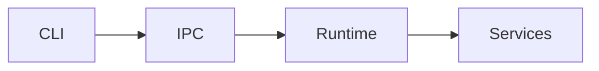

---

# Failure Domains

| Component | Impact                               |
| --------- | ------------------------------------ |
| DNS       | Resolution unavailable               |
| Collector | Health information stale             |
| Rotation  | Route updates stop                   |
| Proxy     | New SOCKS5 sessions fail             |
| TProxy    | Transparent interception unavailable |
| Metrics   | Observability degraded               |
| Logger    | Log output unavailable               |
| IPC       | CLI communication unavailable        |

Where possible, PhantomRelay isolates failures to individual components rather than allowing them to cascade throughout the runtime.

---

# Concurrency Model

PhantomRelay follows several concurrency rules.

## Guarantees

* Services execute independently.
* Shared state is runtime owned.
* Communication is event driven.
* Long-running work is asynchronous.
* Shutdown is cooperative.
* Resource ownership is explicit.

Implementation details may evolve while these guarantees remain stable.

---

# Operational Invariants

The following assumptions are expected to remain true across releases.

### Runtime

* Runtime owns orchestration.
* Runtime owns supervision.
* Runtime owns shared resources.

### Services

* Services remain isolated.
* Services receive explicit capabilities only.
* Services own internal behavior.

### Subsystems

* Subsystems are authoritative.
* Subsystems remain runtime managed.

### Connections

* Kernel owns active transport.
* PhantomRelay tracks but does not own transport.

### Control Plane

* CLI remains external.
* Runtime remains authoritative.
* IPC remains mediation only.
