# Data Flow & Patterns

## Overview

This document describes how data moves through PhantomRelay and how the major subsystems interact.

---

## System Traffic Flow

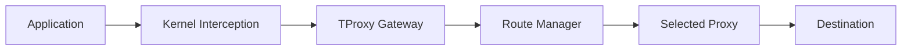

### Flow

1. Application creates a connection.
2. Traffic is intercepted by the network layer.
3. PhantomRelay receives the connection.
4. Route Manager selects a healthy route.
5. Connection is forwarded through the selected proxy.
6. Data is relayed until termination.
7. Session is removed from the registry.

---

## DNS Resolution Flow

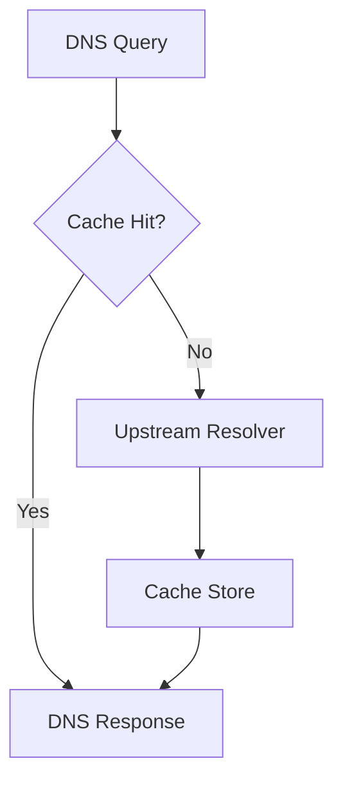

### Cache Lifecycle

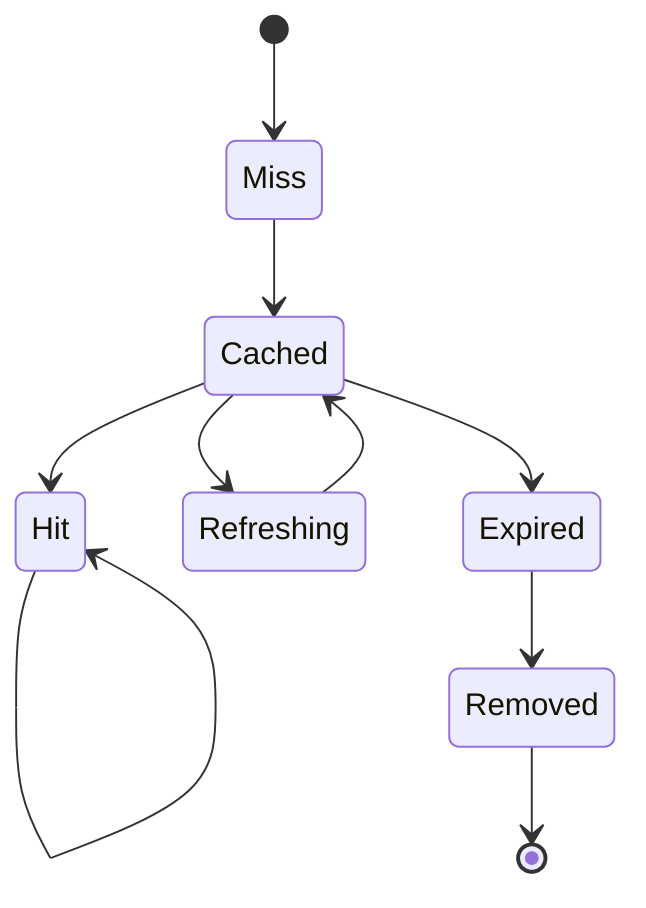

---

## Route Selection Flow

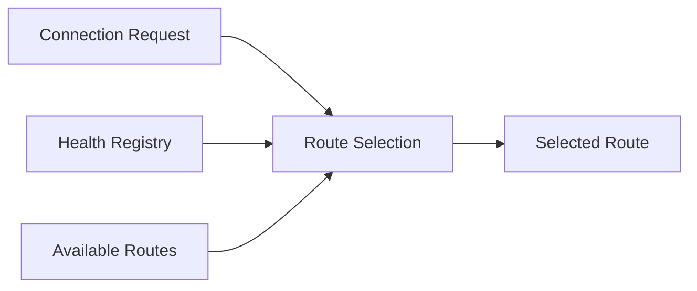

### Selection Rules

- Only healthy routes are eligible.
- Failed routes are skipped.
- Recovered routes automatically rejoin rotation.
- Selection strategy remains independent of transport implementation.

---

## Proxy Health Flow

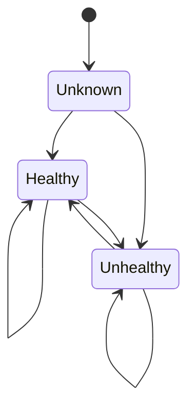

### Health Evaluation

1. Health Monitor performs validation.
2. Results update the Health Registry.
3. Route Manager consumes registry state.
4. Failed routes are excluded.
5. Recovered routes are restored.

---

## Service Management Flow

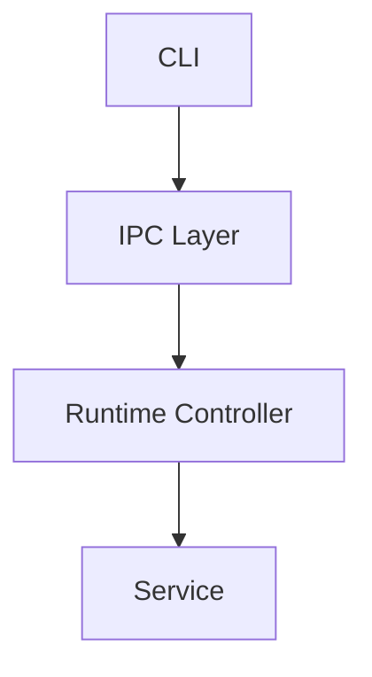

### Lifecycle

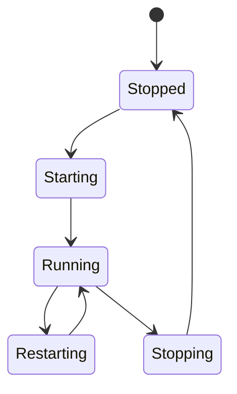

---

## Event Flow

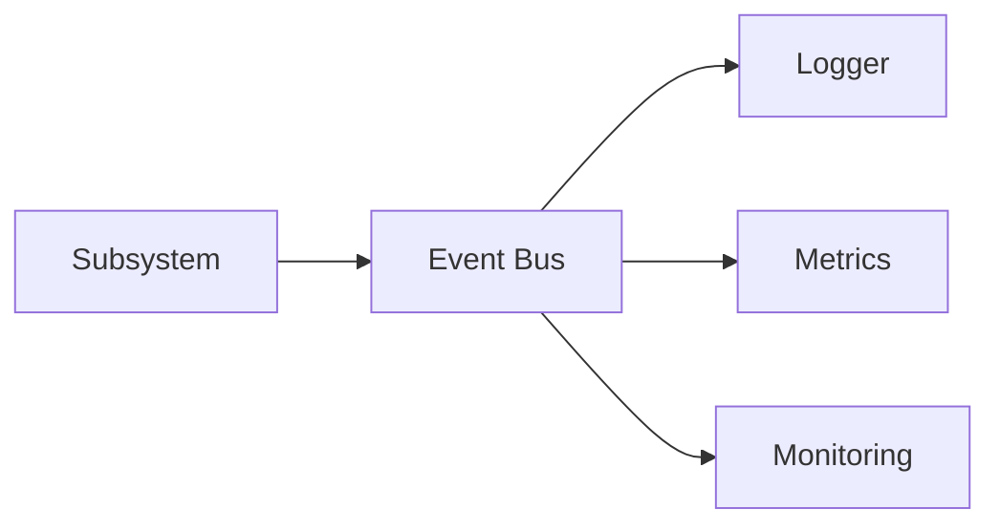

### Characteristics

- Fan-out distribution.
- Decoupled publishers and subscribers.
- No direct subsystem dependencies.
- Supports observability and monitoring.

---

## Connection Lifecycle

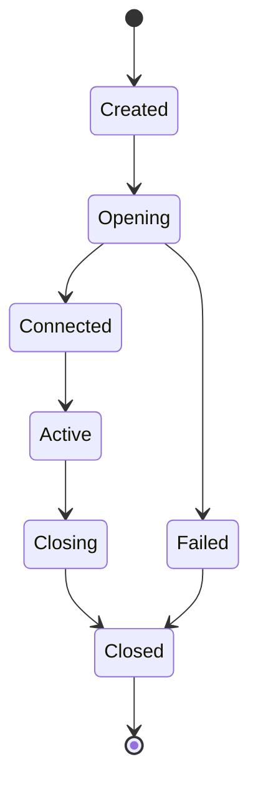

---

## Failure Recovery

### DNS Failure

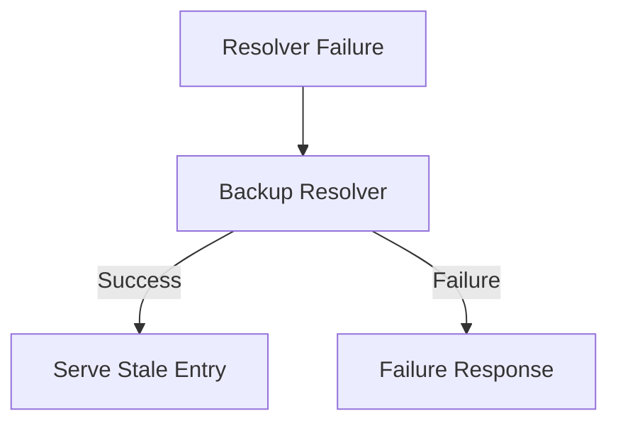

### Proxy Failure

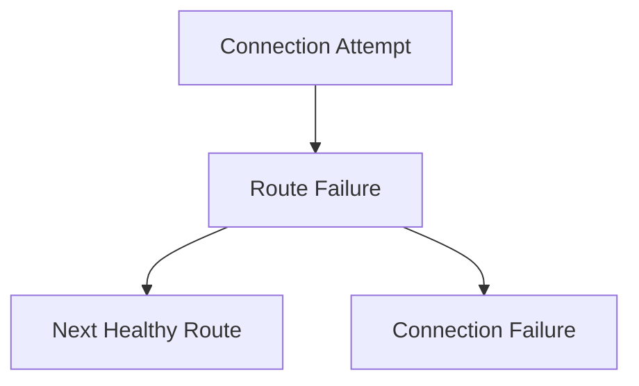

---

## Concurrency Model

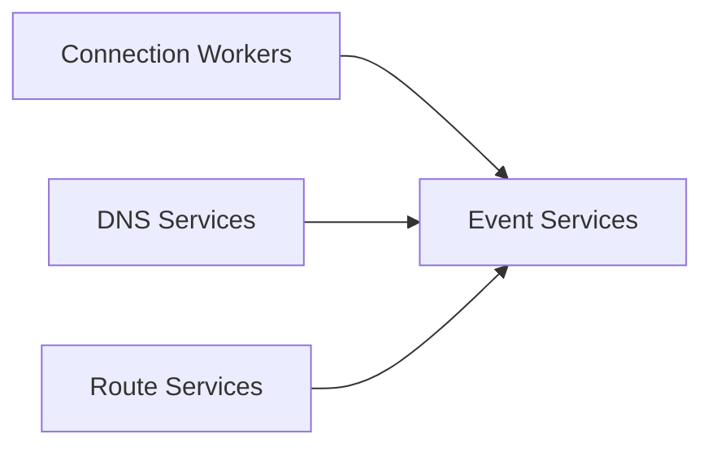

### Principles

- Independent services.
- Shared state ownership boundaries.
- Read-heavy optimization.
- Graceful shutdown.
- Failure isolation.

---

## Startup Sequence

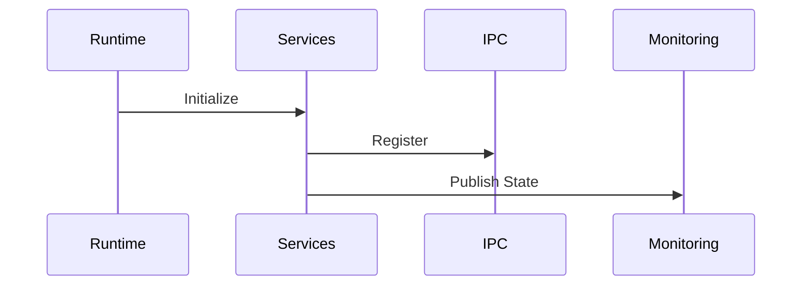

---

## Shutdown Sequence

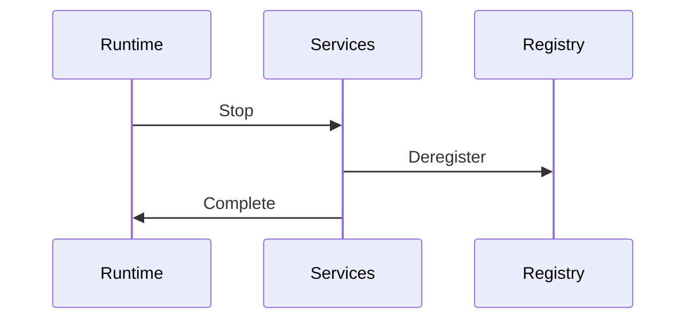

---

## Architectural Invariants

1. Traffic always passes through route selection.
2. Route selection only uses healthy routes.
3. DNS cache remains optional but transparent.
4. Services remain independently restartable.
5. Monitoring never participates in request processing.
6. Failures remain localized whenever possible.
7. Shutdown is always coordinated by the Runtime Controller.
