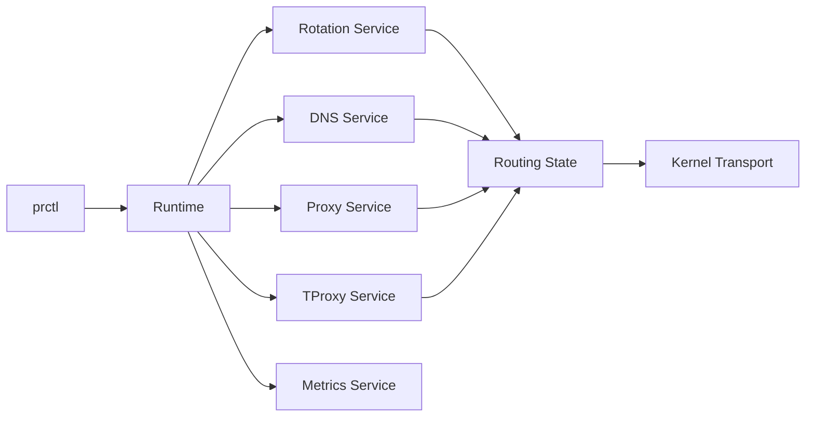
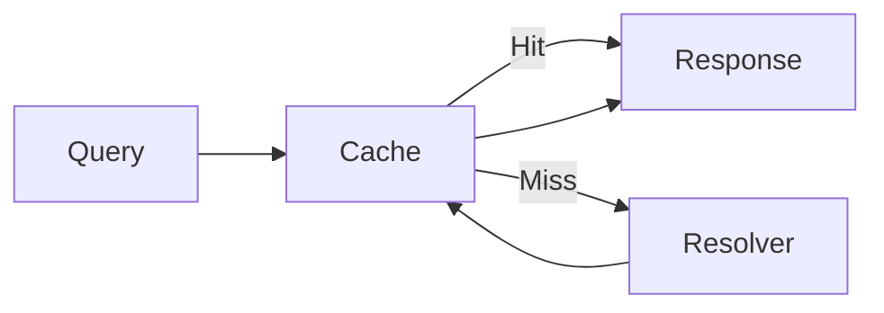

<p align="center">
  
</p>
<p align="center">
  Runtime-Oriented Linux Traffic Orchestration
</p>

<p align="center">
  Transparent Proxying • Route-Aware DNS • Intelligent Routing • Service Isolation
</p>

<p align="center">
  
  
  
  
</p>

---

PhantomRelay is a high-performance Linux traffic orchestration runtime that manages transparent proxying, DNS resolution, routing intelligence, and connection lifecycles through a resilient service-oriented architecture.

Designed around kernel-native transport semantics and runtime-managed orchestration, PhantomRelay provides a foundation for building reliable proxy-aware networking systems.

---

## Table of Contents

- [Why PhantomRelay?](#why-phantomrelay)
- [System Architecture](#system-architecture)
- [Core Capabilities](#core-capabilities)
- [Installation](#installation)
- [Quick Start](#quick-start)
- [Control Plane](#control-plane)
- [Configuration](#configuration)
- [Traffic Flows](#traffic-flows)
- [Troubleshooting](#troubleshooting)
- [Contributing](#contributing)
- [License](#license)

---

## Why PhantomRelay?

Traditional proxy solutions often combine routing, DNS resolution, health monitoring, traffic handling, and lifecycle management into a single tightly coupled process.

PhantomRelay takes a different approach.

It provides a runtime-oriented architecture where networking components operate as isolated services managed through a central orchestration layer.

This enables:

- Independent service recovery
- Runtime-level observability
- Route-aware DNS resolution
- Health-aware proxy orchestration
- Flexible traffic mediation
- Kernel-native connection handling

Rather than treating proxy rotation as the core abstraction, PhantomRelay treats networking infrastructure as a collection of runtime-managed services coordinated through a unified control plane.

---

## System Architecture



PhantomRelay is built around a runtime that owns service lifecycle management, subsystem supervision, routing state, and resource coordination.

Services remain independently recoverable while critical subsystems remain under runtime ownership.

For detailed internals, concurrency patterns, subsystem interactions, and component diagrams, see [ARCHITECTURE.md](./ARCHITECTURE.md).

---

## Core Capabilities

| Capability | Description |
|------------|-------------|
| Runtime Orchestration | Centralized lifecycle management and supervision |
| Transparent Proxying | Linux TProxy-based traffic interception |
| DNS Resolution | Route-aware DNS with caching and DoH |
| Proxy Routing | Health-aware dynamic route selection |
| Connection Tracking | Real-time connection lifecycle management |
| Observability | Metrics, logging, runtime diagnostics |
| Control Plane | IPC-driven runtime management |
| Scalability | Async Tokio architecture designed for concurrency |

---

## Installation

### Prerequisites

- Linux kernel with netfilter support (for TProxy)
- nftables v1.0.0+

Install the latest PhantomRelay release:

```bash
curl -fsSL https://raw.githubusercontent.com/suy0x1/phantom_relay/main/install.sh | sudo bash
```

---

## Quick Start

Start core services:

```bash
prctl start dns
prctl start proxy
prctl start tproxy
```

Check runtime status:

```bash
prctl status
```

Inspect current routing state:

```bash
prctl debug route
```

View active connections:

```bash
prctl debug conn
```

---

## Control Plane

### Service Management

```bash
# Check status of all services
prctl status

# Start specific services
prctl start dns
prctl start proxy
prctl start tproxy

# Stop services
prctl stop dns

# Restart a service
prctl restart proxy
```

### Runtime Modes

```bash
# Enable DNS turbo mode
prctl enable dns-turbo

# Disable DNS turbo mode
prctl disable dns-turbo
```

### Available Services

| Service | Description |
|----------|-------------|
| logger | Event logging system |
| dns | DNS resolution and caching |
| proxy | SOCKS5 proxy server |
| tproxy | Transparent proxy interceptor |
| proxy_rotator | Proxy rotation engine |
| proxy_collector | Proxy health monitoring |
| cache_preloader | Background cache prewarmer |
| cache_cleaner | Cache expiry cleanup |
| cache_refresher | Cache refresh service |
| metrics | Prometheus metrics endpoint |

### Available Modes

| Mode | Description |
|------|-------------|
| dns-turbo | Aggressive DNS cache saturation mode |

### Debug Commands

```bash
# View current configuration state
prctl debug config

# View active connections
prctl debug conn

# View DNS cache status
prctl debug dns

# View proxy status
prctl debug proxy

# View current routing state
prctl debug route
```

---

## Configuration

Configuration is managed through a TOML configuration file (`phantomrelay.toml`) and loaded by the runtime during daemon startup.

Services receive only the configuration they require, maintaining strict service isolation while preserving centralized configuration management.

### Example Configuration

```toml
[dns]
host = "127.0.0.1"
port = 9002
max_parallel_dns_lookups = 100
cache_cleanup_interval_secs = 30
cache_refresh_secs = 5
min_prest_hits = 25
cache_saturation = false
prewarm_domains = [
    "google.com",
    "github.com",
    "youtube.com"
]

[proxy]
host = "127.0.0.1"
port = 9003

[tproxy]
host = "127.0.0.1"
port = 9001

[rotation]
rotate_sec = 60

[collector]
total_workers = 100
latency = 3500
fetch_public = false
path = "/path/to/proxies.txt"

[default]
services = ["logger", "metrics"]

[logger]
level = "INFO"
```

For complete configuration documentation, see [CONFIGURATION.md](./CONFIGURATION.md).

---

## Traffic Flows

### Transparent Traffic Flow


### Direct Proxy Flow


### DNS Resolution Flow



---

## Troubleshooting

### Daemon Won't Start

Verify kernel support:

```bash
grep -i tproxy /boot/config-*
```

Verify IPC socket availability:

```bash
lsof /tmp/phantomrelay.sock
```

Ensure PhantomRelay is running with sufficient privileges for transparent interception.

### High CPU Usage

- Verify cache prewarming intervals are reasonable
- Check cache maintenance services are functioning
- Inspect event bus subscriber behavior
- Monitor metrics for abnormal service activity

### DNS Resolution Issues

Verify DNS service status:

```bash
prctl status
```

Check:

- Upstream resolver reachability
- Cache activity
- DNS service health
- Runtime logs

### Proxy Connectivity Issues

Check:

- Proxy health status
- Collector service state
- Route selection
- Network connectivity to proxy endpoints

Inspect current routing state:

```bash
prctl debug route
```

### Emergency Network Recovery

If PhantomRelay terminates unexpectedly and traffic interception remains active:

```bash
sudo nft delete table inet phantomrelay
```

---

## Contributing

Contributions are welcome.

1. Fork the repository
2. Create a feature branch
3. Add tests for new functionality
4. Ensure all tests pass with `cargo test`
5. Document significant design decisions
6. Submit a pull request

---

## License

See the LICENSE file in the repository root.

---

## Further Reading

- [ARCHITECTURE.md](./ARCHITECTURE.md) — Runtime architecture and subsystem design
